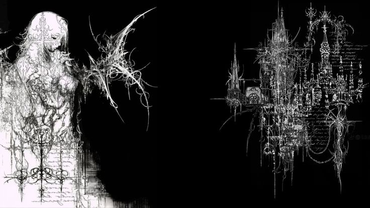

  

<h1 align="center">Tomás Gameiro</h1>

  <b>Game AI · Unreal Engine · AR / Simulation · C++</b>

  

  
  
  

---

## 👋 About

  I am a <b>Games and Multimedia</b> student from Portugal focused on <b>Game AI</b>, <b>Unreal Engine</b>, <b>AR</b>, and <b>simulation-driven gameplay systems</b>.

  I enjoy building gameplay logic that feels responsive and alive: autonomous agents, role-based behavior, interaction systems, mobile AR workflows, and clean C++ / Blueprint architecture.

---

## 🧠 Core Skills

<table align="center" width="92%">
<tr>
<td width="50%" valign="top">

### 🎮 Game Development

- Unreal Engine gameplay systems
- C++ and Blueprint workflow
- Touch and mobile interaction
- 3D camera systems
- Android build/testing workflow

</td>
<td width="50%" valign="top">

### 🤖 Game AI

- Behavior Trees
- Blackboard architecture
- AI Perception
- Role-based agents
- Simulation-style decision logic

</td>
</tr>
<tr>
<td width="50%" valign="top">

### 📱 AR / Simulation

- AR surface interaction concepts
- Mobile AR prototypes
- Spatial interaction design
- Real-world anchored gameplay ideas
- Physical + digital system integration

</td>
<td width="50%" valign="top">

### 🛠️ Programming & Tools

- C++ / C# / Python
- JavaScript / PHP basics
- Git and GitHub
- Visual Studio / VS Code
- Clean, readable project structure

</td>
</tr>
</table>

---

## 🚀 Project Direction

<table align="center" width="92%">
<tr>
<td width="50%" valign="top">

### 🌱 OfficeBloom

AR / 3D desk-garden concept focused on real-world surfaces, tabletop interaction, Android AR scanning, and mobile-first camera control.

**Main technical focus:**
- AR scanning flow
- 3D tabletop mode
- Touch camera orbit
- Plant placement systems
- Unreal Engine mobile workflow

</td>
<td width="50%" valign="top">

### ⚽ Game AI Systems

Autonomous gameplay prototypes focused on decision-making, role logic, football-style simulation AI, and agent coordination.

**Main technical focus:**
- Behavior Trees
- Blackboard keys
- AI Perception
- Role-based logic
- Simulation gameplay behavior

</td>
</tr>
</table>

---

## 🧰 Tech Stack

  

  
    Unreal Engine · C++ · Blueprints · Game AI · AR · Simulation · Git · Visual Studio
  

---

## 📊 GitHub Stats

<table align="center" width="92%">
<tr>
<td width="50%" align="center">
  
</td>
<td width="50%" align="center">
  
</td>
</tr>
</table>

  

  

---

## 🎯 Current Focus

  Strengthening <b>Unreal Engine C++</b> systems · Building polished <b>Game AI</b> prototypes · Improving <b>AR interaction</b> workflows · Growing a portfolio for <b>Game AI / Simulation AI / AR</b> roles

---

## 📫 Connect

  
  

  <i>Building intelligent systems, immersive worlds, and clean gameplay architecture.</i>

