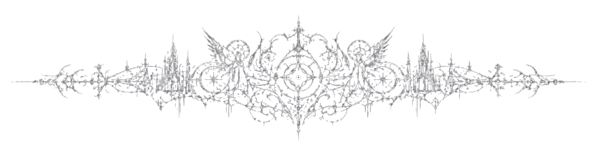
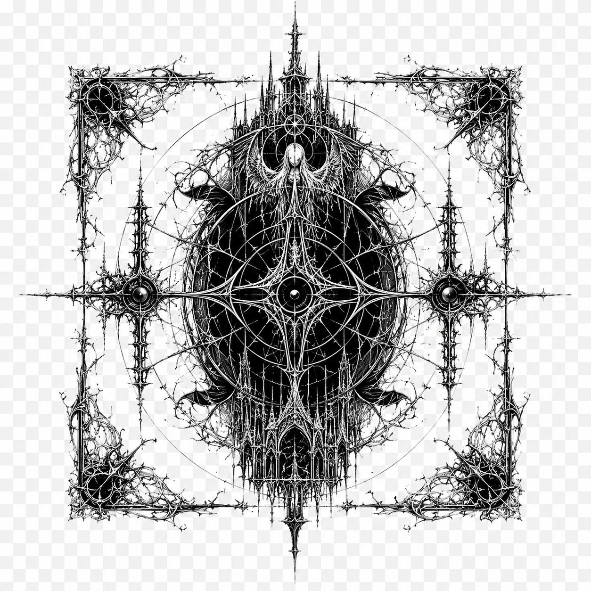

  

  

  

<h1 align="center">Tomás Gameiro</h1>

  

  
  
  

  

<h2 align="center">THE ARCHIVE</h2>

  <i>
    I build systems that feel alive: autonomous agents, spatial interaction, AR placement,
    3D camera control, and gameplay logic designed to feel clean, responsive, and atmospheric.
  </i>

<table align="center" width="92%">
<tr>
<td width="50%" valign="top">

<h3 align="center">OfficeBloom</h3>

  

  AR / 3D desk-garden experience built around real-world surfaces, tabletop interaction,
  Android AR scanning, and mobile-first camera control.

  Unreal Engine · Android AR · 3D Camera · Interaction Systems

</td>
<td width="50%" valign="top">

<h3 align="center">Game AI Systems</h3>

  

  Autonomous behavior prototypes focused on decision-making, role logic,
  behavior trees, and simulation-style agents.

  Behavior Trees · Blackboard · AI Perception · Simulation AI

</td>
</tr>
</table>

  

<table align="center" width="92%">
<tr>
<td width="50%" valign="top">

<h3 align="center">AR Fitness Concept</h3>

  A mobile AR demonstrator concept for exercises, equipment anchoring,
  and spatial guidance inside gym or home environments.

  AR Anchoring · Mobile UX · Spatial Guidance · Research Prototype

</td>
<td width="50%" valign="top">

<h3 align="center">Current Focus</h3>

  OfficeBloom development 
  Gameplay AI experiments 
  Unreal Engine portfolio polish 
  Simulation / AR career direction

</td>
</tr>
</table>

  

<h2 align="center">SYSTEM READINGS</h2>

  
  

  

  

  

<h2 align="center">TOOLS OF THE CRAFT</h2>

  

  
    Unreal Engine · Gameplay Systems · Game AI · AR Interaction · C++ · C# · Python · Git
  

  

<h2 align="center">ROADMAP</h2>

  Build stronger Unreal Engine systems 
  Improve AI decision-making prototypes 
  Create polished public portfolio projects 
  Explore AR grounded in real spaces 
  Move toward Game AI / Simulation AI / AR engineering roles

  

<h2 align="center">CONNECT</h2>

  
  

  <i>Clean systems. Atmospheric visuals. Intelligent interactions.</i>

  

