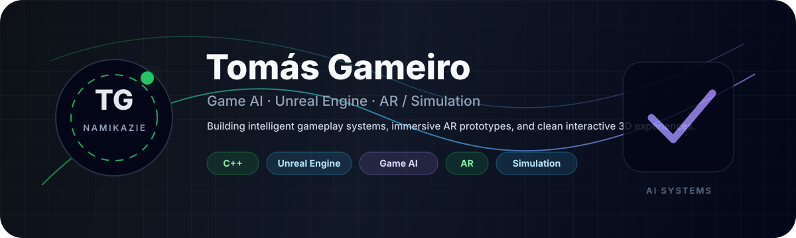

  

  

<h1 align="center">Tomás Gameiro</h1>

  <b>Game AI · Unreal Engine · AR / Simulation · C++ Developer</b>

  
  
  

  <b>On a journey to build intelligent, immersive, and polished interactive worlds.</b>

---

<table>
<tr>
<td valign="top" width="62%">

## Hello 👋

I'm **Tomás Gameiro**, a **Games and Multimedia** student from Portugal focused on **Game AI**, **Unreal Engine**, **AR**, and **simulation-driven gameplay**.

I enjoy building systems that combine **technical logic** with **playable design** — AI agents, spatial interaction, 3D camera control, AR placement, and gameplay features that feel clean, responsive, and alive.

### I’m passionate about
- 🎮 Game AI and autonomous agents
- 🧠 Behavior Trees, Blackboard logic, and decision systems
- 🛠️ Unreal Engine C++ / Blueprints
- 🌱 AR interaction and spatial gameplay
- 📱 Mobile-first 3D design
- 🧩 Clean, scalable gameplay architecture

</td>
<td valign="top" width="38%">

## Quick profile

- 📍 Portugal
- 🎓 Games & Multimedia student
- 💻 Main stack: **C++**, Unreal Engine, C#, Python
- 🎯 Goal: **Game AI / Simulation AI / AR roles**
- 🌿 Flagship project: **OfficeBloom**

  

</td>
</tr>
</table>

---

## Present status

👉 Refining **OfficeBloom**, an AR / 3D desk-garden experience built around scanned surfaces, tabletop interaction, and mobile-first camera control.  
👉 Expanding my work in **gameplay AI**, role-based agents, and simulation logic.  
👉 Improving my portfolio toward **Game AI**, **Simulation AI**, and **AR** roles.  
👉 Exploring how real-world spaces can blend naturally with interactive 3D systems.

---

## Featured work

<table>
<tr>
<td valign="top" width="50%">

### 🌿 OfficeBloom

An AR / 3D desk-garden concept built around the idea of turning a real desk or surface into a living digital space.

**Focus areas**
- Android AR surface scanning
- 3D tabletop mode
- Touch camera orbit system
- Plant placement and interaction ideas
- Unreal Engine mobile workflow

</td>
<td valign="top" width="50%">

### 🤖 Game AI systems

Projects and prototypes focused on autonomous agents, decision-making, and role-based gameplay behavior.

**Focus areas**
- Behavior Trees
- Blackboard-driven decisions
- AI Perception concepts
- EQS-style support positioning
- Football / simulation role logic

</td>
</tr>
</table>

  

---

## GitHub stats 👨‍💻

  
  

  

---

## Skills 🌱

<b>Show skills</b>

 

  

### Core areas

- **Game development:** Unreal Engine, gameplay systems, interaction systems
- **Game AI:** Behavior Trees, Blackboard logic, role-based agents, simulation logic
- **Programming:** C++, C#, Python, JavaScript, PHP
- **Tools:** Git, GitHub, Visual Studio, VS Code

---

## Projects & portfolio direction 🔥

<b>Show projects & contributions</b>

 

- **OfficeBloom** — AR / 3D desk-garden experience concept
- **FinalProject-SpookyMess** — 3D game project
- **Football AI systems** — autonomous agents and role logic
- **AR fitness demonstrator** — mobile AR concept for training guidance
- **Portfolio direction** — AI, AR, simulation, and polished gameplay systems

---

## Roadmap ⚡

<b>Show roadmap</b>

 

- Build more polished Unreal Engine gameplay systems
- Create stronger public portfolio projects
- Improve AI decision-making prototypes
- Explore AR that feels grounded in real spaces
- Move toward Game AI / Simulation AI / AR engineering roles

---

## Connect

  
  

  <b>Clean systems. Playable worlds. Intelligent interactions.</b>

